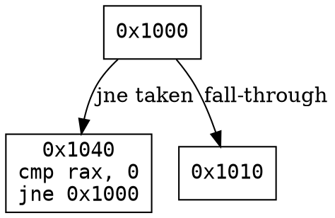

<div align="center">


**Advanced Python Executable Reverse Engineering Suite**

*Built entirely in Rust — fast, native, no compromises.*

[](https://www.rust-lang.org/)
[](https://www.microsoft.com/windows)
[](https://github.com/emilk/egui)
[]()
[]()

</div>

---

## What is RvSpy?

RvSpy is a standalone, self-contained reverse engineering workstation purpose-built for analyzing **Python compiled executables** — specifically targets packed with **PyInstaller**, **Nuitka**, **cx_Freeze**, **py2exe**, and similar bundlers.

Unlike generic RE tools, RvSpy is opinionated: everything in the interface, every engine, every analysis module is calibrated toward understanding Python executables at the binary level — from PE structure down to bytecode parsing, string extraction, network IoC hunting, and live x64 debugging.

No Python runtime required. No .NET. No Java. One binary, zero dependencies.

---

## Table of Contents

- [Why RvSpy?](#why-rvspy)
- [Features Overview](#features-overview)
- [Architecture](#architecture)
- [Core Modules](#core-modules)
  - [PE Parser](#pe-parser)
  - [Python Bytecode Parser](#python-bytecode-parser-pyc)
  - [Disassembler Engine](#disassembler-engine)
  - [Pseudo-C++ Decompiler](#pseudo-c-decompiler)
  - [Nuitka Recovery Engine](#nuitka-recovery-engine)
  - [Behavioral Signature Scanner](#behavioral-signature-scanner)
  - [Entropy Analyzer](#entropy-analyzer)
  - [String & IoC Extractor](#string--ioc-extractor)
  - [Control Flow Graph (CFG) Engine](#control-flow-graph-cfg-engine)
  - [Native x64 Debugger](#native-x64-debugger)
  - [x64 Sandbox Emulator](#x64-sandbox-emulator)
  - [Heuristics Engine](#heuristics-engine)
  - [Native Hooking Engine (C/ASM)](#native-hooking-engine-casm)
- [Advanced Power Toolbar](#advanced-power-toolbar)
- [GUI Overview](#gui-overview)
  - [Payload Explorer (Left Panel)](#payload-explorer-left-panel)
  - [Main Editor Area (Tabs)](#main-editor-area-tabs)
  - [Output & Analysis Panel (Bottom)](#output--analysis-panel-bottom)
  - [Debugger View (Right Panel)](#debugger-view-right-panel)
- [Themes](#themes)
- [Localization](#localization)
- [Hex Viewer & Patcher](#hex-viewer--patcher)
- [Requirements](#requirements)
- [Building from Source](#building-from-source)
- [Running RvSpy](#running-rvspy)
- [Usage Guide](#usage-guide)
- [Keyboard Shortcuts](#keyboard-shortcuts)
- [Configuration & Persistence](#configuration--persistence)
- [Roadmap](#roadmap)
- [Credits](#credits)

---

## Why RvSpy?

Most reverse engineering tools are either:

1. **Too generic** — built for C/C++ binaries, with zero understanding of Python packer internals.
2. **Too slow** — built on Electron, Java, or interpreted languages that add hundreds of milliseconds to every action.
3. **Too fragmented** — you need 6 different tools to do what RvSpy does in one window.

RvSpy was written from scratch in **Rust** with a native **egui** UI, meaning it compiles to a single `.exe` with no installer needed, starts instantly, and consumes minimal RAM even when analyzing multi-megabyte executables.

```
┌─────────────────────────────────────────────────────────────┐
│                     RvSpy Architecture                       │
│                                                             │
│  [Drag & Drop EXE] ──► [PE Parser] ──► [Packer Detection]  │
│                              │                              │
│                    ┌─────────┴──────────┐                   │
│                    │                    │                   │
│              [Nuitka Engine]    [PyInstaller Engine]        │
│                    │                    │                   │
│              [PYC Extractor]    [OVERLAY Extractor]         │
│                    │                    │                   │
│            [Bytecode Parser] ──► [Symbol Recovery]          │
│                    │                                        │
│              [Disassembler] ──► [Pseudo-C++ Output]         │
│                    │                                        │
│            [CFG Generator] ──► [Graph Visualization]        │
│                                                             │
└─────────────────────────────────────────────────────────────┘
```

---

## Features Overview

### Analysis Engines

| Feature | Description |
|---|---|
| **Deep PE Parsing** | Full DOS/NT/File/Optional header breakdown, section table, import table, export table |
| **Nuitka Resource Recovery** | Extracts `.pyc`, `.pyi`, `.so` and embedded resource files from Nuitka-compiled EXEs |
| **PyInstaller Overlay Extractor** | Locates and extracts the CArchive/PKG overlay from PyInstaller bundles |
| **Python Bytecode Parser** | Reads `.pyc` magic numbers, flags, timestamps, and raw co_code buffers |
| **x64 Disassembler** | Fast Capstone-based disassembly of `.text` sections and arbitrary memory regions |
| **Pseudo-C++ Decompiler** | Lifts x64 instructions to readable C-like pseudocode with type hints |
| **Control Flow Graph** | 3-pass CFG construction: leader identification → block building → edge linking |
| **Graphviz DOT Export** | Export any CFG as a `.dot` file for visualization in external graph tools |
| **Entropy Calculator** | Shannon entropy per-section to detect packed/encrypted blobs |
| **Behavioral Signature Scanner** | Static analysis against a built-in signature database (network, persistence, crypto) |
| **String Extractor** | Wide + ASCII string extraction with configurable minimum length |
| **Network IoC Hunter** | Extracts IPs, domains, URLs, and suspicious DNS patterns from binary blobs |
| **Filepath IoC Hunter** | Identifies hardcoded Windows paths, registry keys, and C2-style path patterns |
| **Custom Signature Hunter** | SIMD-accelerated byte pattern scanning with user-defined hex signatures |
| **Hex Viewer & Patcher** | Full hex editor with address navigation and patch-to-disk support |
| **Memory Patcher** | Live patch injection to a running process's virtual memory |

### Debugging

| Feature | Description |
|---|---|
| **Native x64 Debugger** | Full breakpoint, step, continue, detach cycle via Windows Debug API |
| **Live Register View** | Real-time RAX, RBX, RCX, RDX, RIP, RSP, RFLAGS display |
| **Live Disassembly** | Current instruction stream shown as the debugger steps |
| **Call Stack Tracker** | Hierarchical call stack reconstruction per thread |
| **Memory Search** | Scan a running process's memory for patterns or strings |
| **Process Attachment** | Attach to any running process by PID from the process list |
| **Unity/Python Attach** | Specialized attach workflow for Python runtimes |
| **x64 Code Sandbox** | Emulate arbitrary shellcode in isolation (Unicorn Engine backend) |

### UI & Workflow

| Feature | Description |
|---|---|
| **26 Themes** | From Dracula to Catppuccin, Synthwave, Blood Red, and beyond |
| **3-Language UI** | English, Français, Русский |
| **Payload Explorer** | Hierarchical file tree with PE sub-nodes for DOS/Optional headers and sections |
| **Multi-Tab Editor** | Open multiple analysis tabs in parallel |
| **Word Wrap / Highlight Line** | Standard editor comfort features |
| **Persistent Settings** | All preferences auto-saved via egui's eframe persistence layer |
| **Drag & Drop** | Drop any `.exe` directly onto the window to analyze it |

---

## Architecture

RvSpy follows a clean module separation with no circular dependencies:

```
src/
├── main.rs                   — Entry point, eframe bootstrap
├── gui/
│   └── mod.rs                — Entire UI: menus, panels, popups, tabs, toolbar
├── core/                     — Pure analysis engines (no UI imports)
│   ├── pe_parser.rs          — PE structure parsing
│   ├── strings.rs            — String + IoC extraction
│   ├── entropy.rs            — Shannon entropy calculation
│   ├── heuristics.rs         — Packer detection heuristics
│   ├── behavioral_scanner.rs — Static behavioral signature matching
│   ├── nuitka_recovery.rs    — Nuitka archive extraction
│   ├── cfg.rs                — Control Flow Graph engine
│   ├── debugger.rs           — Native x64 debugger (Windows API)
│   └── emulation.rs          — Unicorn Engine sandbox interface
└── python/
    ├── mod.rs                — Python EXE top-level analysis orchestrator
    ├── pyc_parser.rs         — .pyc magic number + bytecode parsing
    ├── nuitka_mod.rs         — Nuitka-specific extraction pass
    ├── disasm.rs             — Capstone disassembly pipeline
    ├── disassembler.rs       — Disassembler config + output types
    └── pseudo_cc.rs          — x64 → Pseudo-C++ lifter

c_src/
└── hook.c                    — Native inline trampoline (for future live hook injection)

asm_src/
└── scanner.asm               — SIMD-accelerated byte pattern scanner (x64 NASM)
```

The GUI layer (`gui/mod.rs`) owns the application state (`RvSpyApp`), dispatches analysis work through trigger flags, and renders everything using immediate-mode egui. All heavy work runs on background threads and communicates back via `Arc<Mutex<>>` shared state.

---

## Core Modules

### PE Parser

`src/core/pe_parser.rs` — Built on the `goblin` crate, this module provides deep structural parsing of Windows PE (Portable Executable) files.

**Capabilities:**
- Full DOS Header (`e_magic`, `e_lfanew`) parsing
- NT Headers breakdown: Signature, File Header, Optional Header (32 & 64-bit)
- Section table enumeration with raw/virtual address mapping
- Import descriptor table: resolves DLL names and imported function names
- Export directory: lists exported symbols with RVA
- Compiler/packer detection via section name heuristics
- Magic number validation: detects MZ, PE32, PE32+

**Output fields:**
```rust
pub struct PeInfo {
    pub file_type: String,           // "PE32", "PE32+", "Unknown"
    pub entry_point: u64,
    pub image_base: u64,
    pub sections: Vec<SectionInfo>,
    pub imports: Vec<ImportInfo>,
    pub exports: Vec<ExportInfo>,
    pub packer_hint: Option<String>, // "PyInstaller", "Nuitka", "UPX", etc.
    pub md5: String,
    pub sha256: String,
    pub file_size: usize,
}
```

### Python Bytecode Parser (.pyc)

`src/python/pyc_parser.rs` — Decodes the Python `.pyc` file format header.

Python compiled bytecode files always start with a 4-byte magic number that encodes the Python version:

```
Magic bytes  ──►  Python version map:
0x0D0D0A33   ──►  Python 3.8
0x0D0D0A55   ──►  Python 3.9
0x0D0D0A6F   ──►  Python 3.10
0x0D0D0A80   ──►  Python 3.11
```

After the magic: a 4-byte flags field, an 8-byte timestamp/hash, a 4-byte source size, and finally the raw `co_code` marshal stream.

RvSpy's parser validates the header, extracts these fields, and prepares the raw code object buffer for further analysis.

### Disassembler Engine

`src/python/disasm.rs` — Wraps the **Capstone** disassembly framework for x86/x64 binary analysis.

The pipeline:
1. Locate the `.text` section via the PE parser
2. Extract raw bytes from the section buffer
3. Feed to Capstone in x64 mode with AT&T or Intel syntax
4. Annotate each instruction with: offset, bytes, mnemonic, operands
5. Detect function prologues (`push rbp; mov rbp, rsp`) for automatic function boundary detection

**Output format:**
```
0x00001000  55              push    rbp
0x00001001  48 89 E5        mov     rbp, rsp
0x00001004  48 83 EC 20     sub     rsp, 0x20
0x00001008  E8 F3 00 00 00  call    0x00001100
```

### Pseudo-C++ Decompiler

`src/python/pseudo_cc.rs` — A multi-pass x64 instruction lifter that transforms raw disassembly into human-readable C-like pseudocode.

**Lifting strategy:**

| Assembly Pattern | Lifted Output |
|---|---|
| `mov [rbp-0x8], rax` | `var_8 = rax;` |
| `call 0x1234` | `func_1234();` |
| `cmp rax, 0x0` + `je 0x5678` | `if (rax == 0) goto loc_5678;` |
| `push rbp` / `pop rbp` | Function prologue/epilogue markers |
| `ret` | `return;` |

The lifter handles: variable name synthesis, type width inference (BYTE/WORD/DWORD/QWORD), local variable tracking via stack offsets, and basic control flow reconstruction.

### Nuitka Recovery Engine

`src/core/nuitka_recovery.rs` + `src/python/nuitka_mod.rs` — Native C++ accelerated engine for extracting resources from Nuitka-compiled executables.

Nuitka compiles Python code to C++ and links it into a native binary. Embedded resources (`.pyc`, `.py`, data files) are stored as PE resource directory entries or appended to the PE overlay with a custom header.

**Extraction pipeline:**
```
 EXE File
    │
    ├─► Scan PE resource directory for Python-typed entries
    │       └─► Extract .pyc / .pyd blobs
    │
    ├─► Scan PE overlay for Nuitka onefile marker
    │       └─► Decompress zlib/zstd blob
    │           └─► Walk temp archive tree
    │
    └─► Write extracted artifacts to user-selected output folder
```

The C++ native analysis bridge (`c_src/nuitka_analyzer.cpp`) is compiled at build time via `build.rs` using the `cc` crate and linked directly into the Rust binary.

### Behavioral Signature Scanner

`src/core/behavioral_scanner.rs` — A static analysis engine that matches extracted string markers against a curated signature database to identify suspicious or malicious behavioral patterns.

**Severity levels:**

```
┌────────────┬───────────────────────────────────────────────────┐
│  CRITICAL  │ Known C2 patterns, shellcode markers               │
│  HIGH      │ Registry persistence, process injection strings    │
│  MEDIUM    │ Network socket calls, crypto library usage         │
│  LOW       │ Temp file paths, common packer artifacts           │
└────────────┴───────────────────────────────────────────────────┘
```

**Example signatures (subset):**

| Signature | Category | Severity |
|---|---|---|
| `WinExec`, `ShellExecuteA` | Execution | HIGH |
| `CreateRemoteThread` | Injection | CRITICAL |
| `HKEY_CURRENT_USER\Software\Microsoft\Windows\CurrentVersion\Run` | Persistence | HIGH |
| `socket`, `connect`, `bind` | Network | MEDIUM |
| `CryptEncrypt`, `CryptDecrypt` | Crypto | MEDIUM |
| `IsDebuggerPresent`, `CheckRemoteDebuggerPresent` | AntiDebug | HIGH |

Each finding includes: matched string, context offset, severity, and a description of what the signature indicates.

### Entropy Analyzer

`src/core/entropy.rs` — Implements the Shannon entropy formula over PE sections.

```
H(X) = -Σ p(xᵢ) · log₂(p(xᵢ))
```

Values close to **8.0** indicate highly randomized (encrypted/compressed) data. Values below **5.0** are typically plaintext. RvSpy color-codes entropy bars in the UI:

- `> 7.2` → RED (likely packed/encrypted)
- `5.5 – 7.2` → YELLOW (mixed)
- `< 5.5` → GREEN (plaintext)

### String & IoC Extractor

`src/core/strings.rs` — Three specialized extraction functions:

**`extract_strings(data, min_len)`**
Scans for contiguous printable ASCII sequences of at least `min_len` characters. Useful for quickly finding embedded passwords, version strings, Python source snippets, and hardcoded paths.

**`extract_network_ioc(data)`**
Uses regex patterns to detect:
- IPv4 addresses (validated octet ranges)
- IPv6 addresses
- Domain names (at least one dot + valid TLD pattern)
- URLs (`http://`, `https://`, `ftp://`)
- Suspicious DNS patterns (DGA-like: high consonant/digit ratio)

**`extract_filepath_ioc(data)`**
Searches for Windows-style file paths:
- `C:\Windows\...`
- `%APPDATA%\...`
- `%TEMP%\...`
- Registry key paths (`HKEY_*\...`)
- Named pipe patterns (`\\.\pipe\...`)

### Control Flow Graph (CFG) Engine

`src/core/cfg.rs` — A 3-pass algorithm for constructing a Control Flow Graph from a disassembled function body.

**Pass 1: Leader Identification**
Marks instruction addresses that begin a basic block:
- First instruction of the function
- Any jump target
- Any instruction immediately following a conditional/unconditional jump

**Pass 2: Block Construction**
Groups consecutive non-branching instructions between leaders into `BasicBlock` nodes.

**Pass 3: Edge Linking**
Analyzes each block's terminator:
- Unconditional jump → 1 successor
- Conditional jump → 2 successors (taken / fall-through)
- Call → treated as transparent (fall-through only)
- Ret → no successor

**Output:** A `ControlFlowGraph` struct with `BasicBlock` nodes and typed `Edge` connections. Can export to **Graphviz DOT format**:



### Native x64 Debugger

`src/core/debugger.rs` — A full debug event loop built on Windows `DebugActiveProcess` / `WaitForDebugEvent` APIs.

**Features:**
- Launch a target process under debugger control
- Attach to an already-running process by PID
- Handle `EXCEPTION_DEBUG_EVENT` (breakpoints, single-step, access violations)
- Set/remove INT3 (`0xCC`) software breakpoints by virtual address
- Resume with `ContinueDebugEvent`
- Capture thread context (`CONTEXT_ALL`) per debug break: all 16 GPRs, RIP, RFLAGS
- Detach cleanly without killing the target

The debugger runs in a **dedicated background thread** and communicates with the GUI through a `DebuggerCommand` channel and a shared `Arc<Mutex<DebuggerState>>`.

```
GUI Thread                  Background Debug Thread
    │                                │
    │── Send(Launch("target.exe")) ──►│── CreateProcess (DEBUG_ONLY)
    │                                │── WaitForDebugEvent loop
    │◄── Mutex update (registers) ───│── On EXCEPTION_EVENT: capture context
    │                                │── ContinueDebugEvent
    │── Send(Detach) ───────────────►│── DebugActiveProcessStop
```

### x64 Sandbox Emulator

`src/core/emulation.rs` — Interfaces with the **Unicorn Engine** to emulate arbitrary x64 shellcode in a fully isolated virtual environment.

> **Note:** Unicorn Engine requires LLVM. Install it with:
> ```
> winget install LLVM.LLVM
> ```
> Or enable the `unicorn-engine` dependency in `Cargo.toml` after LLVM is installed.

The sandbox:
1. Allocates a 2MB virtual stack + 4MB code page
2. Loads the provided shellcode bytes at base address `0x400000`
3. Sets initial register values from the active debug context (or zeros)
4. Executes until `ret` or a hook-defined stopping condition
5. Returns final register state for comparison

The **Register Comparison View** shows before/after values, coloring changed registers green.

### Heuristics Engine

`src/core/heuristics.rs` — Pattern-based packer detection that runs as part of the initial PE analysis pass.

Detection targets include:
- **PyInstaller**: `MEI` string markers, `_MEIPASS` references, CArchive `PYZ` headers
- **Nuitka**: `_Py_InitializeFromConfig`, `__compiled__`, Nuitka runtime DLL imports
- **cx_Freeze**: `cx_freeze` directory markers in resource section
- **UPX**: `UPX0` / `UPX1` section names
- **MPRESS**: `MPRESS1` / `MPRESS2` section names
- **Obsidium**: characteristic section name patterns
- **PyArmor**: `pytransform` string markers, `armor` bootstrap code

### Native Hooking Engine (C/ASM)

`c_src/hook.c` + `asm_src/scanner.asm`

Two low-level native components compiled at build time:

**hook.c** — Implements a 14-byte absolute x64 jump trampoline for inline function hooking:
```c
typedef struct { uint8_t opcode[2]; uint32_t offset; uint64_t address; } JMP_ABS64;
// Layout: FF 25 00000000 <target_address> = jmp [rip+0] ; <address>
```
`InstallNativeHook(target, detour, &original)` patches the first 14 bytes of any function to redirect execution to `detour` while preserving the original prologue bytes in `original`.

**scanner.asm** — An x64 NASM assembly implementation of the custom signature search algorithm, designed to leverage SIMD instructions for scanning large binary blobs at near-memory-bandwidth speeds.

---

## Advanced Power Toolbar

The Power Toolbar sits directly below the menu bar and provides one-click access to the most powerful analysis operations, organized into four contextual groups:

```
┌──────────────────┬──────────────────┬───────────────────┬──────────────────┐
│ [!] Security     │ Reverse Engine   │ [P] Dynamic Debug │ Advanced Hunters │
│ Analysis         │                  │                   │                  │
├──────────────────┼──────────────────┼───────────────────┼──────────────────┤
│ Behavioral Scan  │ Packer Exploits  │ Attach Process    │ Sig Hunter       │
│ Live Mem Strings │ Deep PE Metadata │ Python Attach     │ Code Sandbox     │
│ Network IoC      │ Nuitka Recovery  │ F5 Continue       │ Auto-Decrypt     │
└──────────────────┴──────────────────┴───────────────────┴──────────────────┘
```

Every button opens a **dropdown sub-menu** with related actions, keeping the toolbar compact while surfacing maximum power.

---

## GUI Overview

### Payload Explorer (Left Panel)

The left panel (`[+] Payload Explorer`) renders a hierarchical file tree for every loaded executable. Each EXE node expands to reveal its internal PE structure:

```
▼ [A] TargetApp.exe
    ▼ [P] PE
        [-] DOS Header
        [-] File Header
        [-] Optional Header
        ▼ [+] Sections (5)
            [-] Section #0: .text
            [-] Section #1: .rdata
            [-] Section #2: .data
            [-] Section #3: .rsrc
            [-] Section #4: .reloc
    ▼ [+] Nuitka Resources (12)
        [+] dist/
            [-] main.pyc
            [-] utils.pyc
```

**Right-clicking any section** opens a context menu with:
- Hex View
- Disassemble (x86_64)
- Decompile to Pseudo-C++
- Raw Memory View
- Calculate Information Entropy
- Recover Nuitka Resources
- Extract Strings
- Generate Control Flow Graph (CFG)

### Main Editor Area (Tabs)

The center area hosts multiple analysis tabs. Each tab contains the output of a single analysis operation, e.g.:
- Disassembly of `.text`
- Hex dump of `.data`
- Pseudo-C++ output of a selected function
- String extraction results
- CFG DOT export

Tabs can be closed individually. All content is preserved in memory until a tab is explicitly closed.

### Output & Analysis Panel (Bottom)

The bottom panel has four tabs:

| Tab | Content |
|---|---|
| **Output** | Engine log: file loads, analysis events, errors, and debug messages |
| **Breakpoints** | Active breakpoint list (address, hit count, enabled/disabled) |
| **Locals** | Local variables from the current debug frame |
| **[!] Behavioral** | Behavioral Scanner findings with severity badges |

The Output tab also has "Copy All" and "Save Log" buttons on the right side.

### Debugger View (Right Panel)

When active, the right panel shows:
- **[P] CPU Registers (x64)**: Live-updating register file
- **Live Disassembly**: Current instruction stream around RIP
- **Call Stack**: Active call chain
- **Memory Browser**: Inspect/edit virtual memory at any address

---

## Themes

RvSpy ships with **26 hand-tuned themes** accessible via `View → [T] Theme`:

| Theme | Style |
|---|---|
| Standard (Dark) | Default dark gray — clean and neutral |
| Classic (Light) | Clean white with soft shadows |
| Matrix (Hacker) | Terminal green on pure black |
| Dracula | Purple/pink on deep charcoal |
| Monokai | Earth tones with acid green highlights |
| Solarized Dark | Teal base with blue accents |
| Solarized Light | Cream base, scholarly feel |
| Nord | Arctic blue-gray palette |
| Oceanic | Deep sea blues |
| Cherry Pink | Dark pink neon for maximum contrast |
| Deep Blue | Midnight blue with electric blue highlights |
| Cyberpunk | Deep purple with neon yellow |
| Synthwave | 80s vaporwave aesthetic |
| Gruvbox | Warm retro terminal |
| Midnight | Pure black, white accents |
| Material Dark | Google Material Design, dark variant |
| Material Light | Google Material Design, light variant |
| Ayu Dark | Dark ink with warm orange accents |
| Ayu Light | Soft light with warm accents |
| Night Owl | Deep navy with purple highlights |
| Rose Pine | Muted purple with rose accents |
| Catppuccin | Pastel mocha palette |
| Vampire | Crimson red on near-black |
| Sunset | Warm dark with orange accents |
| Neon Blue | Black with cyan neon |
| Blood Red | Dark red on charcoal |

---

## Localization

RvSpy supports 3 UI languages accessible via `View → [L] Language`:

| Code | Language | Coverage |
|---|---|---|
| `English` | English | 100% (default) |
| `French` | Français | Menus, labels, popups |
| `Russian` | Русский | Menus, labels, popups |

All translations are built directly into the binary — no external locale files required.

---

## Hex Viewer & Patcher

The Hex Viewer provides a classic three-panel layout:

```
Offset    Hex Bytes (16 per row)                         ASCII
00000000  4D 5A 90 00 03 00 00 00  04 00 00 00 FF FF 00  MZ..............
00000010  B8 00 00 00 00 00 00 00  40 00 00 00 00 00 00  ........@.......
```

**Features:**
- Configurable bytes-per-row (8 to 64)
- Offset display in hex or decimal
- Navigate by absolute address or section name
- **Hex Patch**: Edit bytes directly in the hex pane
- **Parse Hex & Apply Patch to Disk**: Write patched bytes back to the file
- **Revert to Original**: Restore pre-patch state from memory

---

## Requirements

### Runtime Requirements

| Component | Minimum |
|---|---|
| **OS** | Windows 10 x64 or later |
| **Architecture** | x86_64 only |
| **RAM** | 256 MB (512 MB recommended for large targets) |
| **Disk** | ~20 MB for the binary |

### Optional Component

| Component | Purpose | Install |
|---|---|---|
| **LLVM** | Code Sandbox Emulator (Unicorn Engine) | `winget install LLVM.LLVM` |

### Build Requirements

| Component | Version |
|---|---|
| **Rust** | 1.75+ (2021 edition) |
| **MSVC Toolchain** | Visual Studio Build Tools 2019+ |
| **NASM** | For `asm_src/scanner.asm` compilation |
| **Cargo** | Ships with Rust |

---

## Building from Source

### 1. Install Rust

```powershell
winget install Rustlang.Rustup
rustup install stable-x86_64-pc-windows-msvc
rustup default stable-x86_64-pc-windows-msvc
```

### 2. Install Visual Studio Build Tools

Download from [Microsoft](https://visualstudio.microsoft.com/visual-cpp-build-tools/) and install:
- **MSVC v143 compiler**
- **Windows 11 SDK**

### 3. Install NASM (for ASM scanner)

```powershell
winget install NASM.NASM
```

### 4. Clone and Build

```powershell
git clone https://github.com/YourUsername/RvSpy.git
cd RvSpy
cargo build --release
```

The output binary will be at:
```
target\release\rvspy.exe
```

### 5. Optional: Enable Unicorn Sandbox

After installing LLVM:
```powershell
winget install LLVM.LLVM
```

Uncomment in `Cargo.toml`:
```toml
unicorn-engine = "2.1.5"
```

Then rebuild.

---

## Running RvSpy

**Development mode** (with live log output):
```powershell
cargo run
```

**Release build** (fastest, recommended for production use):
```powershell
cargo run --release
```

Or run the compiled binary directly:
```powershell
.\target\release\rvspy.exe
```

---

## Usage Guide

### Loading a Target

**Method 1:** Drag & Drop — drag any `.exe` directly onto the RvSpy window.

**Method 2:** Menu — `File → [F] Open... (Ctrl+O)` and select the target.

**Method 3:** Multi-load — `File → Open List...` to load multiple files at once.

### Running Analysis

Once a file is loaded:

1. **Quick Analysis** — The PE parser, heuristic engine, and string extractor run automatically on load.
2. **Deep PE View** — Click `[P] Deep PE Metadata Analysis` in the Power Toolbar or right-click an EXE node.
3. **Disassembly** — Expand the PE tree → right-click `.text` → `Disassemble (x86_64)`.
4. **Behavioral Scan** — Click `[!] Security Analysis → [B] Run Behavioral Scan`. Results appear in the `[!] Behavioral` tab.
5. **Nuitka Recovery** — Click `Reverse Engine → [R] Recover Nuitka Resources`. Extracted files appear in the Payload Explorer.
6. **IoC Extraction** — Click `[!] Security Analysis → [N] Extract Network/DNS IoC`.

### Debugging a Process

1. Load the target EXE.
2. `Debug → |> Start (F5)` — launches the process under the debugger.
3. The debugger view activates on the right panel.
4. Use `|> Continue (F9)`, `Step Into (F7)`, `Step Over (F8)` for navigation.
5. To attach to a running process: `Debug → [*] Attach to Process...` → select from the process list.

### Hex Patching

1. Open any section in Hex View via right-click.
2. Edit bytes directly in the hex or ASCII columns.
3. Click `[P] Parse Hex & Apply Patch to Disk` to write the patch.
4. Click `Revert to Original` to undo.

---

## Keyboard Shortcuts

| Shortcut | Action |
|---|---|
| `Ctrl+O` | Open file |
| `Ctrl+Shift+O` | Open file from site-packages |
| `Ctrl+Shift+S` | Save all tabs |
| `Ctrl+Shift+F` | Search strings |
| `Ctrl+G` | Go to method/offset |
| `F5` | Start / Continue debugging |
| `F7` | Step Into |
| `F8` | Step Over |
| `F9` | Continue (from breakpoint) |
| `Alt+2` | Toggle Output panel |
| `Alt+F4` | Exit |

---

## Configuration & Persistence

RvSpy automatically saves and restores your full workspace configuration using **eframe's persistence layer** (backed by `serde` JSON serialization). Persisted settings include:

- Active theme and language
- UI scale factor
- Font family preference
- Hex viewer: bytes per row, offset display mode
- Editor: word wrap, highlight line
- Analysis options: Python version target, heuristic aggression, max decompilation depth
- Panel visibility states
- Open files list and active tab index

The save file is stored at:
```
%APPDATA%\rvspy\app.json
```

---

## Roadmap

- [ ] **Symbols Server Integration** — Pull public symbols from Microsoft's symbol server for Windows API calls
- [ ] **PyArmor Stripper** — Automated stripping of `pytransform` obfuscation headers
- [ ] **Python 3.12/3.13 Bytecode** — Update PYC parser for new magic numbers and opcodes
- [ ] **Dark Mode Refined Syntax Highlighting** — Proper lexer-based coloring in the disassembly view
- [ ] **Function Renaming** — Persistent name annotations that survive session reloads
- [ ] **Unicorn Full Integration** — Complete sandbox with syscall hooking and network simulation
- [ ] **IDA-style Comments** — Inline annotation support in the disassembly editor
- [ ] **Multi-architecture Support** — ARM64 disassembly target for analyzing cross-compiled targets
- [ ] **Plugin API** — Expose analysis hooks for community-written analyzers
- [ ] **CFG Visual Renderer** — In-app graph visualization instead of DOT-file export only

---

## Credits

<div align="center">

### RvSpy — Advanced Python Reverse Engineering Suite

Built with precision, obsession, and too many late nights.

---

**Core Developer & Architect**

| Name | Role |
|---|---|
| **0Rafas** | Lead Developer — Architecture, Core Engines, GUI, Native Code |

---

**Open Source Foundations**

| Project | Purpose | License |
|---|---|---|
| [Rust](https://www.rust-lang.org/) | Systems programming language | MIT / Apache-2.0 |
| [egui](https://github.com/emilk/egui) | Immediate-mode GUI framework | MIT / Apache-2.0 |
| [eframe](https://github.com/emilk/egui/tree/master/crates/eframe) | egui application bootstrap | MIT / Apache-2.0 |
| [Capstone Engine](https://www.capstone-engine.org/) | Multi-architecture disassembly | BSD |
| [goblin](https://github.com/m4b/goblin) | Binary format parser (PE/ELF/Mach-O) | MIT |
| [Unicorn Engine](https://www.unicorn-engine.org/) | Multi-architecture CPU emulation | GPL-2 |
| [rfd](https://github.com/PolyMeilex/rfd) | Native file open/save dialogs | MIT |
| [serde](https://serde.rs/) | Serialization/deserialization | MIT / Apache-2.0 |
| [regex](https://github.com/rust-lang/regex) | Regular expression engine | MIT / Apache-2.0 |
| [sha2 / md-5](https://github.com/RustCrypto/hashes) | Cryptographic hash functions | MIT / Apache-2.0 |
| [flate2](https://github.com/rust-lang/flate2-rs) | Zlib/DEFLATE compression | MIT / Apache-2.0 |
| [sysinfo](https://github.com/GuillaumeGomez/sysinfo) | System process enumeration | MIT |
| [winapi](https://github.com/retep998/winapi-rs) | Windows API bindings for Rust | MIT / Apache-2.0 |

---

*"Understand everything. Trust nothing."*

</div>

---

<div align="center">

© 2026 P1 — All Rights Reserved

*RvSpy is a private tool. Not for redistribution.*

</div>
